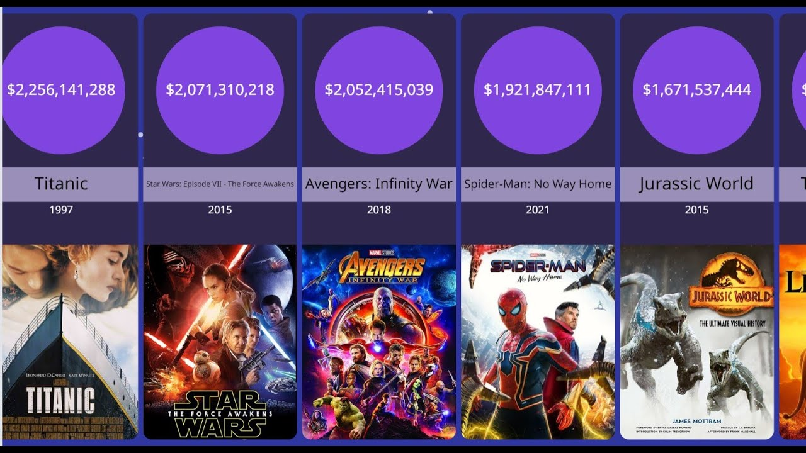
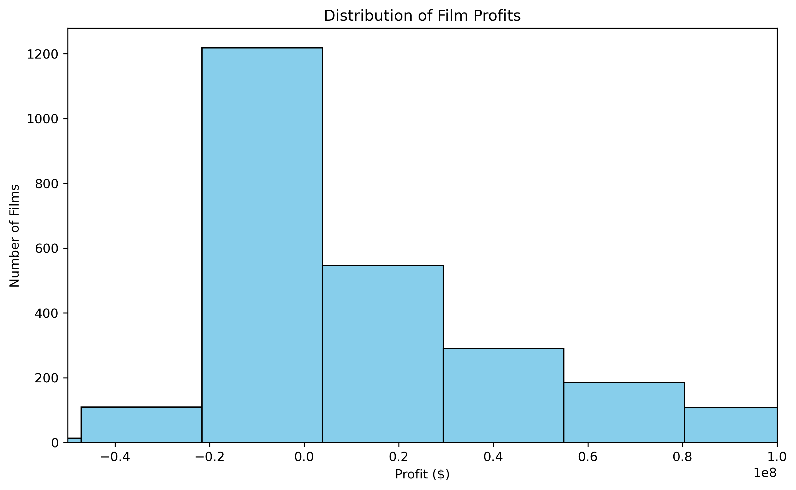
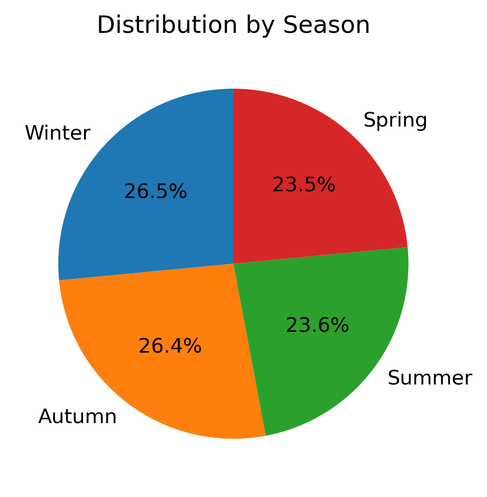
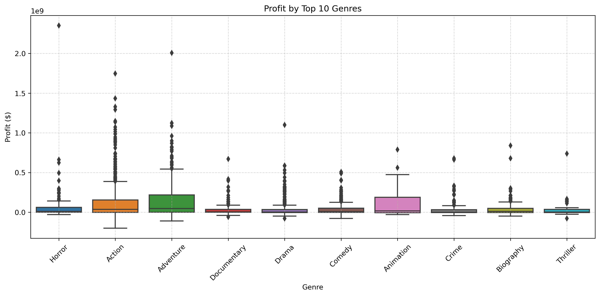

# Akademi (Flatiron School) — Data Science & AI, Cohorte 2025
# Second Project – Phase 2
**Student Name:** Micka LOUIS  
**Student Pace:** Self-paced  
**Submission Deadline:** July 20, 2025  
**Instructors' Names:** Wedter JEROME & Geovany Batista Polo LAGUERRE  
**Blog Post URL:** https://github.com/Micka-Louis/dsc-project-phase-2.git  

 # Project Title       
 
# Box Office Success: A Statistical Approach  
   

# Overview  
This project aims to help a company understand what types of films to produce as part of launching a new film studio. We will analyze data from multiple sources to formulate three concrete business recommendations.  

# Business Understanding & Business Problem  
  
Before investing in a first film, the company wants to minimize risk by relying on evidence, based analysis drawn from historical data. It seeks to understand which genres are the most profitable, whether a film’s duration impacts its revenue, whether highly rated films attract more viewers, if there's a link between popularity (measured by the number of votes) and financial success, or whether certain production formats, such as feature films, should be prioritized.  

This project aims to turn past data into future decisions by providing the studio with concrete and measurable insights to help it choose the right kind of films to produce.  

The business problem can be formulated as follows:    
How can a new film production company maximize its chances of box office success by intelligently choosing the characteristics of the films it produces?  

To address this question, it is necessary to:  

- identify the factors statistically associated with financial success (e.g., revenue),

- measure the strength of the relationships between these factors (duration, rating, genre, votes, etc.) and box office performance,

- and formulate operational and strategic recommendations to guide the studio's early production decisions.

# 1-Data Understanding   
To meet the objectives of the analysis, we rely on **three main data sources**:  

1. **Box Office Mojo (`bom.movie_gross.csv.gz`)** – This dataset provides essential financial information such as domestic and international gross revenue, movie titles, release groups, and studios. 

2. **The Numbers (`tn.movie_budgets.csv.gz`)** – This source adds **budget data**, including production budgets and total worldwide gross, enabling us to analyze the relationship between investment and return.  

3. **IMDb (`IMDb movies.csv` or equivalent)** – This dataset includes critical reception indicators such as **average viewer ratings**, **number of votes**, **genre**, **runtime**, and **type of film** (e.g., feature film, TV series).  

These datasets were merged based on relevant keys like the **movie title** and **release type**, providing an enriched and unified view of each film. This combined perspective allows us to study the **commercial performance**, **viewer perception**, and **production context** simultaneously.  

This understanding phase allows us to:  
- Identify relevant variables for the business problem (e.g., gross revenue, rating, budget, genre),  
- Evaluate data quality (missing values, duplicates, inconsistent formats),  
- Detect potential issues before deeper statistical analysis and modeling.  

# 2-Tools and Methods  
## Data Sources  
- Box Office Mojo (bom.movie_gross.csv.gz): Domestic and foreign gross revenue data for films.  
- IMDb Database (im.db.zip): Core movie data (titles, ratings, genres) accessed via SQLite queries.  

- The Numbers (tn.movie_budgets.csv.gz): Detailed production budgets and worldwide grosses.  

## Statistical Methods  
- Descriptive Statistics: Frequency distribution of genres, runtime distribution, box office earnings. 

- Inferential Statistics:  

>ANOVA (Analysis of Variance) to identify significant profit differences among genres.  

>Tukey’s HSD (Post-hoc Test) for pairwise genre comparisons.

>T-tests to compare average ratings between short and long movies.

>Chi-Square Tests to analyze associations between categorical variables (if applicable).

## Modeling Techniques  
Multiple Linear Regression (OLS):  

>Attempted to predict movie profits based on production budget, runtime, average rating, vote count, genres, and release seasons.  

>Diagnosed model limitations: heteroscedasticity, non-normal residuals, multicollinearity.  

>Due to assumption violations, the model was not used for final business recommendations.  

## Tools Used  

- Python: pandas, numpy, matplotlib, seaborn  
- SQL via SQLite  
- Git and GitHub for version control  

# 3-Results  
### Distribution of profit
  
The graph above illustrates the distribution of film profits in our database. Most films fall within a relatively low profit range, between 0 and 50 million dollars. A strong right skew is also observed, indicating that a small number of films generate exceptionally high profits, while others even incur losses (negative profit). This representation highlights the high heterogeneity of the film market: although some productions achieve significant commercial success, a substantial proportion of films struggle to break even. This observation reinforces the relevance of our study, which aims to model the factors influencing profit in order to provide informed recommendations to a new film production company.  

### Distribution of Movies by season
  
The pie chart illustrates the distribution of film releases across the seasons. We observe a relatively balanced distribution among the four seasons. Autumn (26.4%) and Winter (26.5%) account for slightly more releases, while Spring (23.5%) and Summer (23.6%) have slightly fewer. This distribution suggests a release strategy spread throughout the year, with a slight preference for the end of the year—a period generally favorable for high-potential films (blockbusters, year-end releases, awards contenders, etc.). These data can help identify the optimal release periods to maximize a film’s visibility and revenue.  

### Profit by top 10 genres
  
Genres such as Action, Adventure, and Science Fiction stand out with higher median profits and wider variability, suggesting that while these films can be highly profitable, they also carry greater financial risk.

Genres like Comedy, Drama, and Romance tend to have lower median profits, often close to zero, with fewer extreme values—indicating more modest but potentially more stable returns.

The Animation genre also shows promising profit potential, with a wide spread, although the sample size might be smaller.

In contrast, genres like Film-Noir or Western appear to be less profitable on average, with generally lower medians and fewer high outliers.

Conclusion: Genre is a key determinant of a film’s commercial success. Investing in high-potential genres like Action, Adventure, or Sci-Fi could be a profitable strategy for a new production company aiming to maximize returns. However, these genres typically require larger production budgets, which must be carefully considered alongside potential gains.

### Hypothesis testing  
#### Test 1: Hypothesis   
**Are Big-Budget Films More Profitable Than Low-Budget Films?**   
Hint: We divide films into two groups based on the median production budget.    

**Hypotheses:**   
>H₀: The average profit of high-budget movies is less than or equal to that of low-budget movies.

>H₁: The average profit of high-budget movies is strictly greater.  
**Significance Level**  
α = 0.05  
**Statistical Test :** Student's t-test  
>Result: T-statistic: 17.86, P-value (one-tailed): 0.0000  

### Decision:    
Since the one-tailed p-value is 0.0000, which is less than the significance level α = 0.05, and the t-statistic is positive (17.86), we reject the null hypothesis H₀.    

**Conclusion:** There is strong statistical evidence that high-budget movies (above the median) are significantly more profitable than low-budget ones.     

#### Test 2: Hypothesis  
**Are longer movies (≥ 120 minutes) rated lower than shorter ones?**    

**Hypotheses:**  
>H₀ (null hypothesis): Long movies have an average rating greater than or equal to short movies.  

>H₁ (alternative hypothesis): Long movies have an average rating strictly lower than short movies.  

**Significance Level**  
α = 0.05  

**Statistical Test :** Student's t-test  
>Result: T-statistic:11.84, P-value (one-tailed): 0.0000  

### Decision  
The t-statistic is 11.84 and the one-tailed p-value is 0.0000, which is less than the significance level α = 0.05. However, since the t-statistic is positive, this indicates that long movies actually have a higher average rating than short ones.  

**Conclusion:** Therefore, we do not reject H₀. In fact, we have strong evidence against H₁, and conclude that longer movies are not rated lower, they are rated higher on average.  

#### Test 2: Hypothesis  
**Is there a statistically significant difference in the average profit among different movie genres?**    

Hint:To answer this question, we will conduct a One-Way ANOVA test to determine whether the mean profit varies across genres.  
If the test shows significant results, a Tukey HSD post-hoc analysis will be performed to identify which genres are significantly more or less profitable.    

**Hypotheses:**  
Null Hypothesis (H₀)**  
The mean profit is equal across all genres.    

>H₀: μ_Action = μ_Drama = μ_Comedy = μ_Adventure = ... (no difference in average profit)    

Alternative Hypothesis (H₁)  
At least one genre has a different average profit compared to others.  

>H₁: μ_i ≠ μ_j for at least one pair of genres.  

**Significance Level**   
α = 0.05  

**Statistical Test:** One-Way ANOVA (Analysis of Variance)  
>Result: F-statistic: 20.94, P-value: 0.0000  

### Decision     
The One-Way ANOVA test revealed a statistically significant difference in the average profit among genres
(F-statistic = 20.94, p-value = 0.0000). This indicates that at least one genre's average profit differs from the others.  

To identify which specific genres are more profitable, a Tukey HSD post-hoc test was conducted. The key findings are:

**Significant Profitability Differences Identified:**
- Action movies are significantly more profitable than most other genres:  

 -  Action > Drama (mean difference ≈ 93.7𝑀∗∗,𝑝<0.001)−𝐴𝑐𝑡𝑖𝑜𝑛>𝐶𝑜𝑚𝑒𝑑𝑦(𝑚𝑒𝑎𝑛𝑑𝑖𝑓𝑓𝑒𝑟𝑒𝑛𝑐𝑒≈∗∗
89.1M, p < 0.001)  
 -  Action > Biography, Crime, Documentary, Horror, Thriller (all p < 0.05)  
 -  Action > Adventure (mean difference ≈ $47.8M, p ≈ 0.0095)  
- Adventure films are significantly more profitable than:    

  - Drama, Comedy, Biography, Crime, Documentary, Horror, Thriller (all p < 0.05)  
- Drama vs Family:  
 - Family films show a significantly higher profit than Drama films (mean difference ≈ $133.9M, p ≈ 0.0337)  
 
- Genres with No Significant Profit Differences:   
 - Animation, Sci-Fi, Fantasy, Family (excluding Drama), and Mystery films did not show significant profit differences when compared among each other.  
 - Comedy, Crime, and Documentary genres also did not significantly differ between them in terms of profit.  

**Conclusion Based on Hypothesis Test**  
The analysis confirms that Action and Adventure films are the most profitable genres. Additionally, Family films also demonstrate strong profitability, particularly when compared to Drama. On the other hand, genres like Drama, Comedy, Crime, and Documentary consistently show lower profit margins.  

These insights suggest that the company should prioritize producing Action, Adventure, and Family-oriented films, as they represent the highest potential for maximizing box office returns.  

# 4-Modeling Attempt  
**Objective of the Model**  
The primary objective was to build a statistical model capable of explaining and predicting box office profit based on movie characteristics such as budget, runtime, ratings, votes, release season, and genres. A multiple linear regression approach was adopted to quantify how these factors influence profitability.  
**Interpretation of the OLS Regression Results**  
**Model Performance**  
R-squared (0.498): The model explains approximately 49.8% of the variability in movie profit. This is a moderate level of explanation, indicating that while the model captures key factors influencing profit, a substantial portion of the variance is still unexplained.  

F-statistic (109.6, p-value < 0.001): The model as a whole is statistically significant, meaning that at least one predictor variable is associated with profit.  

**Significant Predictors:** 

- Production Budget (coef = 1.87, p < 0.001):  
Strong positive correlation. For every additional dollar spent on production, profit increases by approximately $1.87 on average. This indicates that higher budgets are generally associated with higher profits.  

- Runtime (coef = -313,100, p ≈ 0.011):  
Negative association. Longer movies tend to generate lower profit. Although significant, the effect size is small compared to budget impacts.  

- Number of Votes (coef = 371.47, p < 0.001): Highly significant positive relationship. More audience engagement (via votes) correlates with higher profits.  

Genres with Significant Positive Effects on Profit:  

>Adventure (+$50.39M)

>Animation (+$60.94M)

>Comedy (+$23.90M)

>Documentary (+$22.58M)

>Drama (+$26.04M)

>Family (+$146.0M) — highest positive coefficient

>Fantasy (+$118.4M)

>Horror (+$58.17M)

>Sci-Fi (+$72.99M)

These genres appear to be strong drivers of profitability.  

**Non-Significant Variables**  
Average Rating (p ≈ 0.178): Surprisingly, a movie's IMDb average rating is not significantly associated with its profit in this model.  

- Several genres such as Biography, Crime, Mystery, Romance, Musical, Music, War, Western, Sport did not show a statistically significant impact on profit.  

- Seasonal Effects: No season (Spring, Summer, Winter) showed a significant impact on profit. Even Summer, which is typically considered a blockbuster season, is only marginally close (p ≈ 0.098).

# 5-Business Recommendations  
Although a multiple linear regression model was developed to predict film profitability, diagnostic tests revealed significant violations of model assumptions (heteroscedasticity, non-normality of residuals, multicollinearity issues). Consequently, the model's outputs cannot be considered fully reliable for business recommendations.  

Therefore, the final strategic insights are based on robust hypothesis testing (ANOVA, Tukey HSD, t-tests), which provided clearer and statistically sound conclusions regarding genre profitability, seasonal effects, and runtime preferences.  

### Business Recommendation 1  
**Prioritize the Production of Action, Adventure, and Family-Oriented Films**  
Our hypothesis testing revealed that Action and Adventure films consistently generate the highest average profits among all genres. Additionally, Family films demonstrate strong profitability, particularly when compared to genres like Drama, Comedy, and Documentary, which tend to yield lower returns.  

For a new studio aiming to maximize box office success, focusing production efforts on Action, Adventure, and Family genres represents a strategic advantage. These genres benefit from wide audience appeal, global marketability, and higher revenue potential, making them optimal candidates for future film projects.  

### Business Recommendation 2 
**Allocate Sufficient Budget to Production**  
Films with higher production budgets consistently demonstrate greater profitability. While budget management remains crucial, investing adequately in production quality—such as casting, special effects, and marketing—can substantially enhance a film’s commercial performance and competitive positioning.  

### Business Recommendation 3  
**Balance Film Length with Audience Engagement**  
Although longer films (running 120 minutes or more) tend to achieve higher profits, they are also associated with slightly lower audience ratings. It is therefore essential to balance runtime with compelling storytelling and pacing to ensure positive viewer reception while capitalizing on profitability.  
# 6-Conclusion  
This analysis provided valuable insights into the key drivers of box office success. Through an integrated dataset combining financial figures, descriptive movie characteristics, and audience ratings, we identified significant patterns that can inform strategic production decisions.  

Our findings revealed that:  

- Release Timing Matters: Movies released during the summer season exhibit significantly higher profits compared to other seasons, making it the most favorable window for maximizing box office returns.  

- Budget is a Critical Factor: Higher production budgets correlate strongly with increased profitability, though they also imply higher financial risk. Strategic investment in production quality and marketing is essential.  

- Film Characteristics Influence Success: Genres like Action, Adventure, and Sci-Fi tend to be more profitable, while genres like Drama and Comedy yield more modest returns. Additionally, films with runtimes between 100 and 130 minutes strike a balance between profitability and audience reception.  

- Audience Engagement is Key: A strong positive correlation exists between the number of votes a film receives and its profit, emphasizing the importance of visibility and popularity in driving financial success.  

Overall, these insights equip the new film studio with data-driven recommendations for optimizing film production choices and release strategies.  
 
# 7-Next Steps 
To further refine and expand this analysis, we recommend the following next steps:  

- Develop a Predictive Profitability Model:  
Build a multiple linear regression model or machine learning model (e.g., Random Forest) to predict box office profit based on variables such as genre, budget, runtime, season, rating, and number of votes.  

- Validate the model’s predictive accuracy and identify key feature importance rankings.  

- Incorporate Marketing & Distribution Data:
Enrich the dataset by integrating variables like marketing spend, number of theaters/screens, and digital platform releases to capture additional factors influencing financial success.

- Expand to International Markets:
Include country-level breakdowns of revenues to explore geographic performance trends, enabling more targeted release strategies.
- Scrape Real-time Data for Trends Monitoring:
Set up web scraping pipelines or API integrations with platforms like IMDb, Box Office Mojo, and The Numbers to keep the dataset updated and monitor evolving market trends.

- A/B Testing for Release Strategies:
Collaborate with marketing teams to design A/B tests around release dates, trailers, and promotional campaigns to empirically measure their impact on audience engagement and ticket sales.

# Repository Structure
├── .ipynb_checkpoints  
├── data  
├── images  
├── .gitattiutes  
├── .gitignore   
├── Final.ipynb  
├── LICENSE  
└── README.md  
